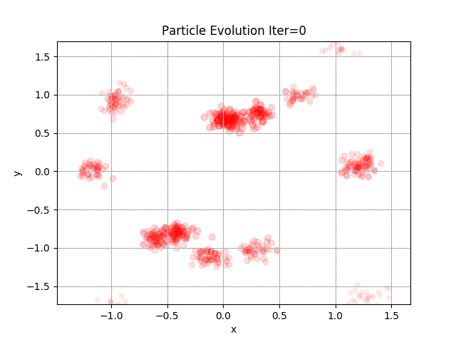
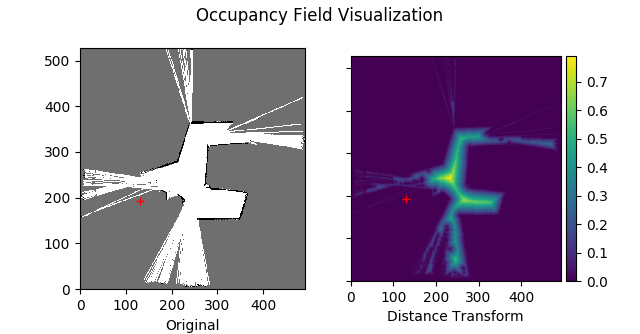
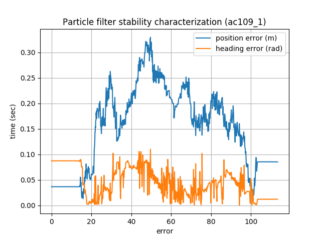
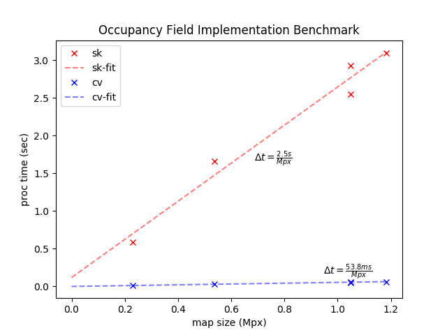

## CompRobo Project 2 : Robot Localization

Oct 11 2018

Yoonyoung Cho, Maximilian Wei

In this project, we implement a particle filter for robot localization with online lidar data and a static pre-built map. During the testing phase, we used the four supplied bags taken around AC109 for preliminary validation of the implementation; for the final iteration, we took the robot and generated the map ourselves, and localized it against the custom-made map.

Fig.1. Sample run of our particle filter implementation from bag data recorded around AC109.

## Problem Solving, Code Structure, Code Implementation

The code architecture revolves around three key processing classes, which are `**ParticleFilter`**, `**ParticleMatcher`**, and `**RosBoss`**. All algorithmic implementations sought to provide a framework-agnostic routines by having minimal dependencies on ROS, where RosBoss handled all basic ROS communications and conversions. Finally, `**pf.py**` provided the ROS Node binding for all three processing handles to expose AMCL-like interface to the end user.

The particle filter itself is fairly standard: it initializes with the given pose at the given "spread", which represents the uncertainty of the state at the point. After a cumulative motion of greater than **0.1m** or **10 degrees**, the particle filter weights are updated with the current scan-matched values and the particles are resampled accordingly. The resampling algorithm follows the algorithm as published by B.Massey (NOTE:  B.Massey, “Fast Perfect Weighted Resampling”, ICASSP, 2009) which claims an efficient O(m+n) weighted resampling for Bayesian Particle Filters.

Fig. 2. Particle Filter evolution by iteration; cost function here is defined as the distance from the origin. Over time, we observe that the particles migrate towards (0,0) and converge to the correct solution.>

One noteworthy aspect of the library is the layer of abstraction that the `ParticleMatcher` class provides, meaning that the preprocessing and filtering of the map and scan data could produce any arbitrary analogous feature for matching. In the interest of time and apparent stability, our implementation of the particle matcher incorporated a modified version of the provided `OccupancyField` library, which reduces the map into the minimum-distance feature representation. The distance is then transformed into the weight by comparing against the absolute difference with the lidar-scan values. The visualization of the said transform can be seen in Fig.3.

Fig. 3. "Occupancy Field" distance transform visualization from the map data; crosshair in red marks the map origin.

To simplify the main code, all the ROS interactions are handled by the **RosBoss** class.  This class reads the odom and laserscan topics, and handles publishing the particles and best particles.  It is instantiated in the main pf.py run, and handles these two functions specifically.  

Testing the particle filter was done by first manually driving the neato just outside AC109 and generating a map file. After obtaining a solid map, the file is saved and then opened up as the reference.  While running the particle filter in rviz and setting an initial estimate, the neato is then driven around, comparing the scans to the map from earlier and localizing itself.

Fig.4. Stability comparison of the particle filter with ground-truth information; note that the solution does not diverge further than 30cm from the correct location, and correctly converges at the end.

## Design Decisions

The provided implementation of Occupancy_Field.py used the SKlearn package to measure distance to the closest particle. To increase speed and lower computational resources required, we opted to use the Open CV2 distanceTransform function. This proved to be a significant improvement that reduced the amount of time required to wait for filter preprocessing initialization.

Fig. 5. Comparison between nearest-neighbor based occupancy field matcher in scikit-learn and Distancetransform-based implementation in opencv.

On part of some basic processing filters on incoming data, we initially set up a check to see if the scan length was less than 0 to avoid errors. However, by simply changing the 0 to a 5, we were able to filter out scans with few data points from increasing the error through bias, leading to a more robust system.

Three options were provided for distance discrepancy to weight transformations: taking the inverse, subtracting from the maximum, and taking the negative exponential. In practice, the exponential version proved to be more stable, and retained the desirable property that at zero distance the probability is 1 and the taper rate could be configured exactly - while there’s no probabilistic justification for the former two. During testing, taking the inverse did prove to be slightly more difficult to work with when numbers approach 0, or were 0.  Subtracting from a maximum allowed for more robust code but the results were less deterministic; the negative-exponential function proved to be most numerically stable and statistically meaningful.

## Challenges

Integration is always a difficult part of projects with multiple features:

One of the particularly challenging parts of this project was the Occupancy field particle matching logic. distance→ weight, etc.

Odom updates bug?

## Potential Improvements

Future project improvements can include cleaning up the map.  Although the boundaries are pretty clearly defined, there is still a decent amount of noise due to all kinds of random interferences.  Although these are difficult to notice by humans looking at the map, these resulting "solid spots" will interfere with the particle cloud calculations and result in poorer quality resampling/matching than what is to be expected.  

The current implementation does not perform detailed analysis on the *health* and general status of the filter, meaning whether or not the current particles are converging to the correct location, or are completely lost and cannot localize within the provided map. Such monitoring capability would improve the robustness of the filter by allowing re-initialization of the particle filter in case of no good candidates, dynamic re-adjustment of the number of particles to reduce the computational load, and modality analysis on the particles to look at the characteristics of the current distribution of particles to provide a better overall stability in the output transformations.

## Lessons Learned

Splitting up code into multiple files for easier development and greater modularity.  
